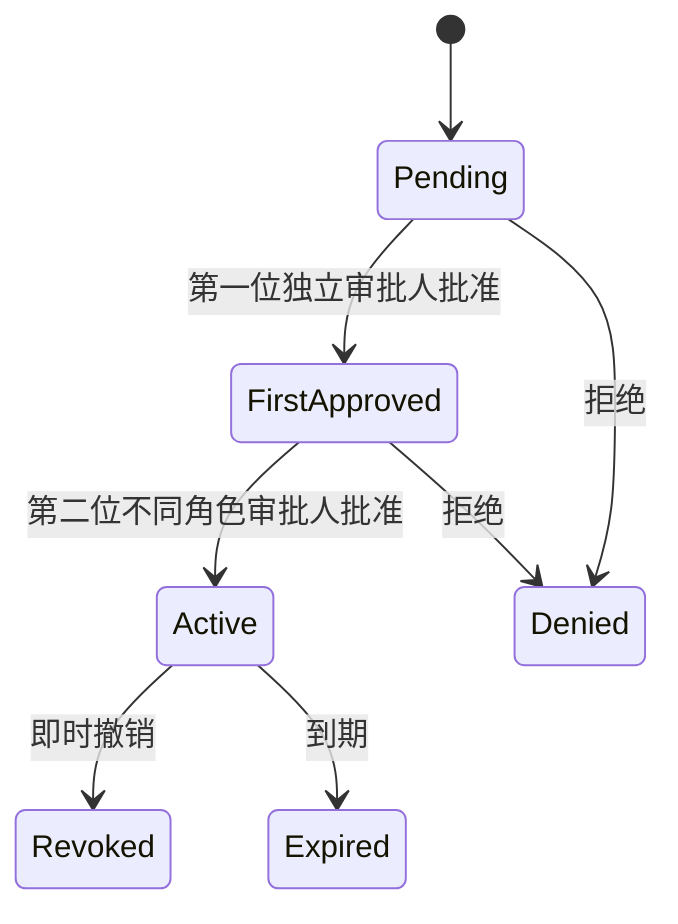

# XMP 园所身份、租户与权限控制面

## 定位与边界

当前版本是一套可在本地运行和验收的访问控制协议，不是生产身份系统。它把 FutureClass 已有的加密 HttpOnly ERP 会话、中间件角色门禁、园区过滤、员工启停状态和 XMP 事件租户注入，重组为 XMP 的统一权限控制面。

审计同时确认：旧 ERP 的部分 RLS 对 `authenticated` 角色授权较宽，主要依赖菜单、Cookie 和应用层过滤，不足以作为多租户生产隔离边界。因此 XMP 采用“默认拒绝”，并预留独立数据库迁移，不直接把旧策略包装成已完成的生产权限。

## 核心策略

- 所有访问先校验租户，再校验园区、班级、模块和动作作用域。
- 角色能力仅是准入起点；会话有效期、可信等级、MFA 和可信设备可以继续收紧权限。
- 高风险临时授权必须由申请人之外的园所管理员与安全负责人分别批准。
- 临时授权有明确到期时间，可即时撤销；人员停用会同时撤销其有效会话。
- 会话支持轮换，历史会话不可继续复用。
- 审计记录追加写入；重复命令幂等，损坏或跨租户快照拒绝恢复。
- 角色可见模块由一个策略目录统一计算，侧栏隐藏与直接 URL 拒绝使用同一规则。

## 高风险授权状态

## 本地实现证据

- 权限目录与纯状态机：`lib/xmp/access-control.ts`
- 浏览器持久化与跨标签同步：`app/xmp/access-control-store.tsx`
- 权限控制面：`app/xmp/access-control-center.tsx`
- 本地存储键：`xmp-access-control-v1`
- 事件域：`access.requested`、`access.approved`、`access.granted`、`access.revoked`、`access.session_revoked`
- 数据库迁移草案：`database/xmp_access_control.sql`

数据库草案强制 RLS，以服务端身份写入；浏览器角色只获得满足租户、主体和职责边界的读取能力。审计表禁止更新和删除。该 SQL 尚未应用到试点 Supabase。

## 验收范围

9 条权限状态机用例覆盖默认拒绝、跨租户/园区拒绝、会话过期、双人审批、禁止自批、限时授权、即时撤销、人员停用、会话轮换、幂等和损坏快照拒绝。事件契约测试同时覆盖 access 域，总计 53 条 XMP 单元与状态机门禁。

浏览器验收完整执行“申请 → 管理员首审 → 安全负责人复审 → 临时放行 → 即时撤销”，并验证家长角色即使直接输入园所运营 URL 也会被拒绝。该流程纳入 21 条系统端到端回归。

## 生产化门禁

正式连接真实园所和儿童数据前，仍需完成：

- 使用真实 Supabase Auth/JWT 声明替代本地演示主体，并验证租户、园区、班级声明的签发和轮换。
- 接入员工入转调离、监护关系和机构成员生命周期，形成自动开通与回收。
- 接入 MFA/WebAuthn、可信设备证明和服务端 API 统一鉴权，禁止只依赖前端门禁。
- 在试点数据库执行迁移，补齐并发审批、服务端时钟、到期任务、通知和 break-glass 应急访问。
- 对所有业务表执行跨租户 RLS 测试，并完成渗透测试、个人信息保护影响评估和正式法律审查。
