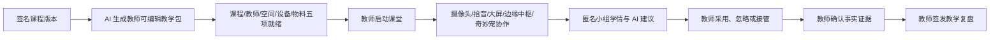

# XMP AI 教学驾驶舱

## 产品方向

本模块不做通用 SaaS 待办或行政审批，而是围绕老师的一节课完成教学数字化：AI 帮老师准备课堂，多组智慧设备服务现场教学，边缘端产生匿名结构化学情，教师决定每一次调整并签发课后复盘。

## 原始需求证据

2026-07-26，文老师在微信发送《幼儿园全年龄段 AI 教育工具“奇妙伙伴”产品设计方案.docx》。本地消息库已定位文件卡片，但附件缓存没有实体 Word 文件，因此本轮没有操作微信前台补抓。

2026-07-27，文老师继续发送完整的软件总体架构正文，明确：

- 教师端视觉行为分析与幼儿端 AI 萌宠是并行的两条教学链路。
- 摄像头、拾音、触控、大屏、边缘盒子和实体萌宠统一接入。
- 原始音视频优先在边缘端处理，向上只传结构化数据。
- 专注、情绪和动作模型应插件化启停，结果只作为教学辅助而非诊断。
- 教师端需要实时课堂看板、学情统计、教学提醒与成长档案。
- 断网时仍应保持本地基础推理与课堂运行。

## 一节课的产品闭环

## 已实现协议

- 课前：从签名课程与排课生成目标、节拍、教师动作和设备动作，生成结果仍可由教师修改。
- 课前门禁：课程、教师、空间、设备、物料五项全部通过后，教师才可开始课堂。
- 课中：AI 只能给建议，不能自主推进节拍、评价儿童或写入成长档案。
- 学情：只呈现匿名小组参与趋势与可观察状态，不做个人排名、医学或心理诊断。
- 设备：关键边缘/视觉设备异常会安全暂停并关闭 AI；设备恢复后仍需教师明确继续。
- 接管：教师可随时接管，释放前 AI 和奇妙宠保持静默。
- 课后：至少一条教师确认的匿名事实证据，才能签发教学复盘。
- 隐私：本地快照拒绝电话、身份证、邮箱和被打开的原始媒体上传/个人排名/诊断能力。

## 本地证据

- 教学协议：`lib/xmp/teaching-workbench.ts`
- 本地持久化：`app/xmp/teaching-workbench-store.tsx`
- 教师工作台：`app/xmp/ai-teaching-workbench.tsx`
- 路由：`/xmp/teaching`
- 本地存储键：`xmp-teaching-workbench-v1`
- 事件域：`teaching.*`
- 隐私优先的数据迁移草案：`database/xmp_teaching_observations.sql`
- 9 条新增状态机测试；XMP 合计 53 条协议测试。

## 演示口径

“备课 48 → 12 分钟”“5 组设备在线”“匿名小组参与脉冲”等均为本地演示过程数据，用来证明产品工作流，不代表真实园所效果。正式融资或销售材料必须用试点教师的前后测、日志与访谈证明真实节省时间和教学价值。

## 生产化边界

数据库草案只提供教学会话、匿名小组脉冲、教师课堂决策和教师确认事实四类结构化表，浏览器无直写权限，决策与证据追加保存，小组脉冲默认 30 天到期。脚本尚未应用到试点 Supabase。

仍需接入真实课程生成任务、教师身份、排课计划、设备证书、边缘代理、摄像头/拾音数据流、视觉算法、模型校准、硬件在环测试、异常调度与教师研究。涉及幼儿学情的模型必须完成合法性评估、偏差测试、误报处置、可解释性设计和真实园所伦理审查。
