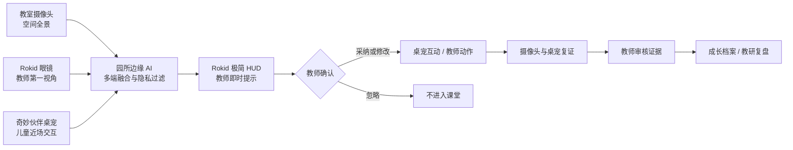

# XMP 三端数智课堂感知与教学闭环

状态：已完成 Supabase 服务端数据层与本地离线降级。未接入真实 Rokid、摄像头、桌宠硬件或儿童数据，未部署云端。

## Supabase 后端

浏览器不直接访问儿童教学数据表。`/api/xmp/orchestration` 先验证 `X-FC-Auth-Token` 园所会话和租户，再由服务端 Service Role 调用 Supabase：

- `xmp_classroom_orchestration_states` 保存每个课堂会话的最新完整状态。
- `xmp_classroom_orchestration_audit` 以修订号和哈希保留不可重复的写入审计。
- `xmp_save_orchestration_state` 在数据库事务内执行乐观锁，阻止多个教师端覆盖彼此的新数据。
- 前端保留 localStorage 离线副本；连接可用后 650ms 合并写入，冲突时停止覆盖并明确提示。
- 标准化信号、证据候选、干预和执行动作表继续用于后续分析与报表投影。

启用本地连接前，先在目标 Supabase SQL Editor 执行 `database/xmp_classroom_orchestration.sql`，再配置：

```bash
NEXT_PUBLIC_SUPABASE_URL=...
SUPABASE_SERVICE_ROLE_KEY=...
XMP_TENANT_ID=...
XMP_ORCHESTRATION_MODE=supabase
```

Service Role 只能存在于服务器环境，不能使用 `NEXT_PUBLIC_` 前缀。未配置时页面会明确显示“本地安全副本”，不会伪装成已经入库。

## 产品定义

XMP 不是设备管理平台，也不是课堂监控系统。它以“儿童中心、教师主导、数据赋能”为原则，通过三类互补端点持续理解真实教学现场：

- 教室固定摄像头：看见全班空间、群体互动、移动和材料区变化。
- 教师 Rokid 眼镜：补充教师第一视角、近场表达和教学语境，以极简 HUD 给出即时提示。
- 奇妙伙伴桌宠：采集近场语音、触摸与材料操作，并把教师确认的教学策略转成儿童可感知的互动。

园所边缘中枢完成时间对齐、来源标注、重复消解、授权检查和场景理解。系统覆盖集体教学、区域活动、户外运动和生活活动，形成“采集—分析—决策—调整—评价”的数智教学闭环。



## 数据分级

1. A 级：90 秒课堂群体信号，用于现场节奏、参与分布和安全提示，24 小时过期。
2. B 级：经监护授权的个体证据候选，使用儿童业务代号，必须绑定课程目标、来源、置信度、目的和过期时间。
3. C 级：教师结合现场观察确认后的结构化成长证据，才允许进入长期档案。

原始声音和画面只进入园所边缘环形缓存，不上传云端。AI 只能生成“观察”和“待核实假设”，不得直接生成情绪结论、能力诊断、排名或永久画像。单一来源证据显著标记，来源冲突时不得自动入档。

## Rokid 交互原则

- 眼镜端只显示图标、短句和必要数字，详细证据留在教师工作台。
- 提示位避开顶部反光区域，主要内容位于视野中心安全区。
- 教师通过语音或触控采纳、稍后或忽略；AI 不自动驱动课堂。
- 摄像、麦克风、P2P 通讯与消息能力以具体 Rokid 型号和试点 SDK 实测为准。
- 现阶段优先评估 Glass3 企业 SDK 路线；硬件续航、固定焦距、显示分辨率和网络断开均需降级设计。

## 关键状态规则

- 只有可信边缘设备可上报多端融合时窗。
- 只有当前可信教师可切换场景、处理建议和审核个体证据。
- 课堂暂停、关键设备离线、安全接管或课程节拍变化会阻止建议执行。
- 桌宠响应必须来自教师已确认动作；执行后进入摄像头与桌宠复证。
- 未审核证据到期自动清除；教师否决的候选不得进入成长档案和家长报告。
- 所有教师决定进入事件链，保留来源、目的和审计上下文。

## 试点验收

1. 在一个班级接入双固定机位、一副 Rokid 和一组桌宠，验证三端时钟与盲区互补。
2. 选择集体教学和区域活动两种高频场景，建立教师人工标注基线。
3. 验证提示延迟、误报率、教师采纳率、节省记录时间和课后证据审核时长。
4. 完成监护人分模态授权、采集指示、物理遮挡、断网降级与 24 小时删除演练。
5. 真实硬件和课堂伦理评审通过前，不宣称注意力、情绪或能力识别准确率。
