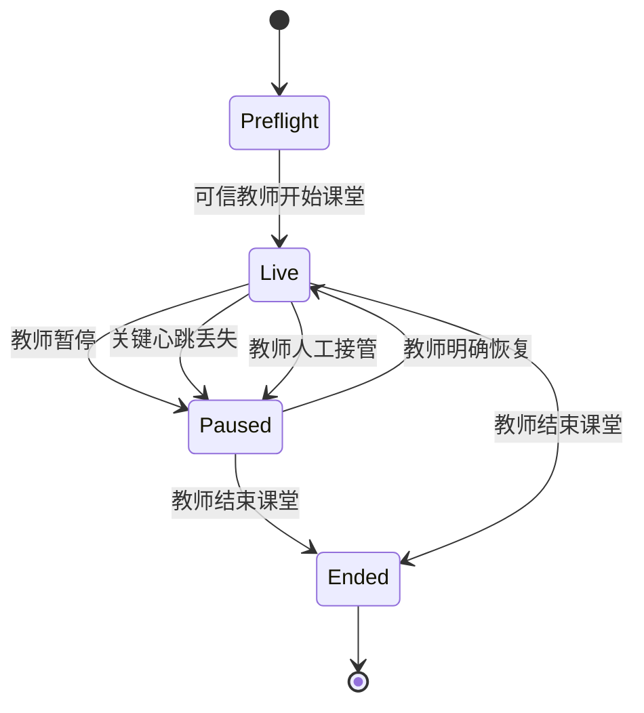

# XMP 本地课堂会话运行时

状态：本地可运行版本。未连接真实设备、未把演示身份当作生产认证、未部署云端。

## 目标

课堂控制不能依赖散落在 React 组件里的布尔变量。XMP 使用一个纯函数状态机统一处理教师控制、课堂生命周期、AI 权限、设备身份、心跳状态、故障降级、恢复与命令审计。课堂控制台和设备舰队共享同一快照，避免两个页面对现场状态产生不同解释。

## 状态模型

生命周期、健康与安全模式彼此独立：

- 生命周期：`preflight / live / paused / ended`。
- 健康：`healthy / degraded / offline`。
- 安全模式：`normal / quiet / teacher-control`。

关键设备离线时，运行时强制关闭 AI；进行中的课堂自动暂停并进入静默模式。设备恢复后只恢复 `healthy`，不会自动恢复课堂或重新开启 AI，必须由教师再次确认。

## 可信主体与设备

当前本地版本使用明确标注的 `demo-verified` 身份：文老师会话指纹 `LOCAL·7F3A`、独立的园所运维主体，以及教师端、大屏、边缘中枢和奇妙宠设备组四个设备主体。它证明产品协议和界面行为，不证明真实密码学身份。教师可控制课堂与设备演练，园所运维只能执行设备断线/恢复，不能开始、暂停或恢复教学。

每个设备记录设备 ID、类型、关键性、信任状态、连接状态、心跳序号、最近心跳、延迟和能力范围。设备心跳命令必须由与目标设备 ID 一致的主体提交；伪造或错配心跳会被状态机拒绝。

## 命令协议与不变量

每条课堂命令包含命令 UUID、类型、可信主体、发生时间和白名单载荷。运行时保持以下不变量：

1. 相同命令 ID 最多执行一次。
2. 非设备命令必须来自当前课堂的可信教师。
3. 人工接管时不能恢复课堂；释放接管后仍保持暂停和静默。
4. 关键设备离线时不能开始或恢复课堂。
5. 已结束课堂不可重新启动或切换节拍。
6. AI 只能在课堂进行中、健康非离线且安全模式为 `normal` 时启用。
7. 所有接受、拒绝和去重结果进入最多 40 条的本地命令审计。

## 本地持久化与多标签页

快照保存在 `xmp-classroom-runtime-v1`，并通过浏览器 `storage` 事件同步其他标签页。加载时会验证版本、会话 ID、枚举、教师主体和设备结构；损坏或伪造快照不会覆盖当前运行状态。

课堂与设备页的“断线演练”只修改本地快照，并产生脱敏业务事件，不会向真实设备发送指令。

## 生产化边界

进入真实园所试点前仍需：

- 使用服务端会话派生教师主体，替换 `demo-verified`。
- 使用设备证书、密钥轮换和防重放序列验证心跳。
- 将命令处理迁移到园所边缘代理，以服务端序列号保证多控制端一致性。
- 建立心跳超时调度、设备隔离、死信告警、时钟偏差和断电恢复测试。
- 把本地命令审计追加到租户事件表，并完成角色、园所和课堂级授权测试。
- 完成真实设备沙箱、硬件在环测试和园所事故回滚演练。
