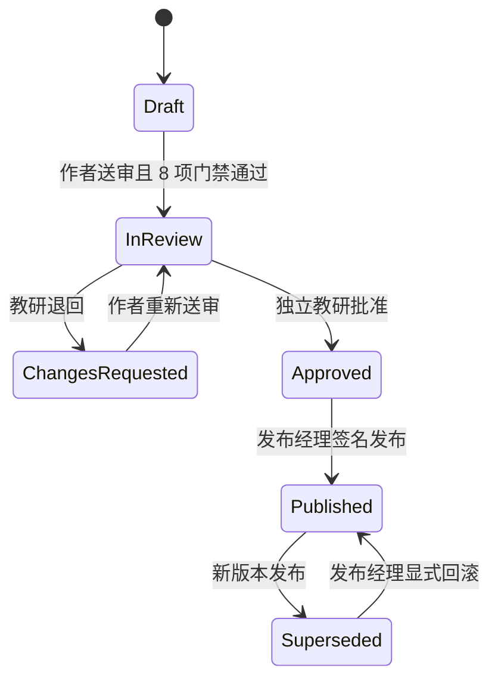

# XMP 课程资产版本与受控发布

状态：本地可运行协议。课程生成仍为演示，不连接生产模型、真实儿童数据或云端资产库。

## 目标

课程不能以“最后一次保存覆盖上一版”的方式进入真实课堂。XMP 把课程建模为不可覆盖的版本资产，并把作者、教研审核、发布、课堂锁版与回滚组成一条可审计的本地协议。

## 责任分离与状态机

- 作者只能送审自己的草稿，不能批准或发布。
- 审核人与作者必须是不同主体。
- 发布经理不能绕过独立审核与安全门禁。
- 已发布版本带本地演示签名、发布时间和资源校验和，不再被原地修改。
- 所有接受、拒绝与重复命令进入追加式本地审计。

## 课堂锁版

“园所当前发布版本”和“当前课堂锁定版本”是两个不同指针。发布新版本不会替换已经准备或正在运行的课堂：

1. 新版本完成审核并签名后，成为园所当前发布版本。
2. 只有课堂处于 `preflight` 时，发布经理才能把当前发布版本设为下一堂课的锁定版本。
3. 课堂进入 `live / paused / ended` 后，任何换版命令都会被拒绝。
4. 课堂控制台直接读取锁定版本的节拍、时长、教师提示、大屏文案与发布签名。
5. 发布回滚不会改变正在运行的课堂；回滚版本只能用于下一次课前锁定。

## 结构化差异与安全门禁

本地种子资产包含 v3.2.0 和 v3.3.0。界面可比较总时长、节拍时长、追问脚本和教学包校验和。当前八项门禁覆盖年龄语言、教师最终控制、身份最小化、禁止自动评判、对话边界、身体负荷、家庭任务隐私和离线降级。

课程目录保存在 `xmp-course-assets-v1`，通过浏览器 `storage` 事件跨标签页同步。加载时验证目录版本、课程 ID、当前发布版本、课堂锁定版本和签名；损坏快照不会进入运行状态。

## 当前验证

- 7 条课程发布领域测试覆盖职责分离、门禁阻断、签名发布、课中拒绝换版、回滚、幂等和损坏快照。
- 本地浏览器完整走通“草稿 → 送审 → 批准 → 发布 → 课前锁版 → 课堂读取 v3.3 → 开课 → 回滚发布 → 拒绝替换课堂”。
- XMP 类型检查与 21 条系统端到端回归继续作为整体门禁。

## 生产化边界

当前 `LOCAL-SIG-*` 只证明产品协议，不是生产密码学签名。试点前仍需把目录迁移到租户数据库，使用服务端身份、不可变对象存储、正式签名密钥、发布审批策略、边缘缓存校验、冲突处理和灾难恢复演练，并验证生成任务与 FutureClass 课程资产的真实读写适配。
