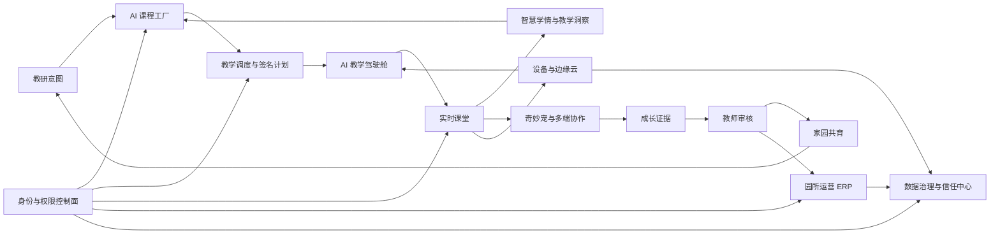
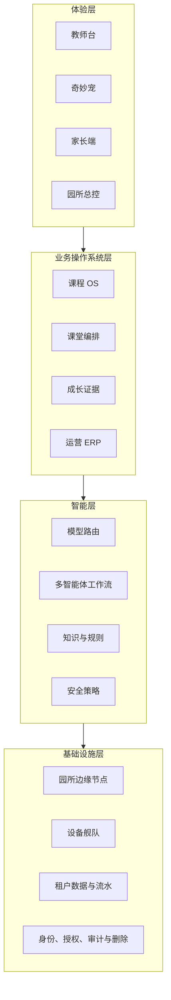

# XMP「奇妙伙伴」产品与融资叙事底稿

> 状态：本地产品演示版（Local Demo）
>
> 边界：未连接生产儿童数据，未部署云端；页面中的园所、幼儿、家庭、课堂与经营数字均为演示数据。
>
> 用途：产品演示、内部评审、客户访谈和融资尽调准备，不作为收入证明、客户合同或合规认证。

## 一句话定位

XMP 是以提升教师教学效率为核心的幼教 AI 操作系统：连接 AI 备课、智慧课堂、匿名学情、多设备协作、教师复盘与成长证据；ERP、身份和治理能力负责支撑它安全、稳定地进入更多园所。智慧学情不是儿童评分，而是“教学问题—课堂证据—教师判断—下一课调整”的教研闭环。

## 用户与价值

| 角色       | 原有断点                       | XMP 的核心价值                                         |
| ---------- | ------------------------------ | ------------------------------------------------------ |
| 园所管理者 | 教学质量与设备运行彼此割裂     | 看见每节课是否准备充分、设备就绪、教师已复盘           |
| 教研负责人 | 内容生产慢，课程与现场脱节     | 从教研意图生成结构化教案，并保留审核、版本和复用能力   |
| 主班教师   | 备课、授课、观察与复盘重复耗时 | AI 准备教学包，多端协作，建议可采用/忽略，事实一键复盘 |
| 儿童       | 传统屏幕交互认知负担高         | 通过安全、克制、可静音的奇妙宠获得多模态体验           |
| 监护人     | 周报滞后且缺少证据             | 收到教师确认的成长证据、家庭任务和反馈闭环             |
| 交付团队   | 每所园重新项目制实施           | 使用六阶段交付、设备舰队、工单与验收标准复制上线       |

## 产品闭环

闭环的关键不是“生成更多内容”，而是每一步都拥有明确输入、责任人、人工门禁和可追溯输出。

当前本地版本已用统一课堂关联 ID 和追加式本地事件流连接课程发布、教学调度、AI 教学驾驶舱、实时课堂、成长审核、家庭发布、设备处置与访问控制。课程版本必须经过独立教研审核、八项安全门禁和发布经理签名；教学计划进一步验证教师、空间、设备包三类资源冲突和课程、教师、空间、设备、物料五项就绪。AI 教学驾驶舱再把这些资产转成老师的一节课：生成教师可编辑教学包，协调摄像头、拾音、大屏、边缘中枢与奇妙宠，用匿名小组趋势辅助巡班，所有建议、证据与复盘仍由教师决定。关键心跳丢失会自动暂停并关闭 AI，设备恢复后仍需教师明确恢复，人工接管也必须显式释放。身份与治理能力是教学底座，不是产品主叙事。跨页面操作可以在“教学闭环事件链”中复盘；服务端迁移层尚未在真实园所数据库执行或接入生产身份与设备证书。

## FutureClass 能力复用矩阵

“复用”分为三层：现有代码与数据模型证据、XMP 产品重组、生产连接状态。当前演示版不得把“已有底座”表述成“已经生产接通”。

| FutureClass 现有能力证据                                                           | XMP 重组后的产品能力                                          | 当前状态         | 生产化下一步                                   |
| ---------------------------------------------------------------------------------- | ------------------------------------------------------------- | ---------------- | ---------------------------------------------- |
| `app/edu/generator`、`app/api/generate/*`、统一模型与媒体提供器                    | AI 课程工厂：版本差异、独立审核、门禁、签名、锁版、回滚       | 本地发布协议     | 接入真实生成任务、资产库与正式签名密钥         |
| `erp_classes`、`erp_schedules`、周排课查询与批量排课动作                           | 教学调度：三类资源冲突、五项就绪、代课、签名与回滚            | 本地调度协议     | 接入 ERP 事务、并发锁、设备证书与正式签名      |
| 课程生成、课堂舞台、语音/视觉链路、成长时间线与设备运行能力                        | AI 教学驾驶舱：备课、五项就绪、多设备课堂、匿名学情、教师复盘 | 本地教学协议     | 接入真实视觉算法、边缘代理、设备证书与教师试点 |
| 课堂结构化事件、匿名小组脉冲、教师确认事实与课程版本                              | 智慧学情：跨课堂证据门槛、AI 教学假设、教师研判、下一课调整   | 本地教研协议     | 接入边缘结构数据并开展教师小规模验证           |
| `components/stage.tsx`、课堂生成与语音/视觉链路                                    | 实时课堂：教师台、状态机、可信命令、Copilot、多端恢复         | 本地运行协议     | 接入真实身份、边缘代理与硬件在环测试           |
| 语音、视觉、TTS 与多模型能力                                                       | 奇妙宠：低认知交互、物理静音、教师接管                        | 本地交互演示     | 接入边缘运行时、内容安全和设备身份             |
| `erp_growth_archives`、`components/erp/growth-timeline.tsx`、`api/scribe/generate` | 成长智能：证据审核、成长地图、签发报告                        | 聚合只读适配     | 接入证据对象、教师签名和版本化报告             |
| 家长报告生成与成长档案能力                                                         | 家园共育：周报、家庭任务、反馈回流                            | 本地交互演示     | 接入监护关系、消息送达、回执与授权状态         |
| ERP 学员、课程、班级、排课、考勤、库存、财务、员工、线索                           | 园所运营：业务健康、交付里程碑、审批、流水                    | 聚合只读适配     | 建立正式租户 RLS 与经审批的业务写入服务        |
| `erp_financial_ledgers` 不可变流水模型                                             | 课消确认收入、权益变更与审计留痕                              | 产品口径已重组   | 统一流水事件模型，补齐退款/转课/库存事务       |
| 现有浏览器、媒体和设备相关运行能力                                                 | 设备与边缘云：遥测、诊断、灰度发布、降级                      | 本地交互演示     | 接入设备代理、签名发布、真实遥测与工单系统     |
| 加密 HttpOnly ERP 会话、中间件角色门禁、园区过滤与员工启停状态                     | 身份与权限：默认拒绝、作用域、会话保障、JIT 双审与撤销        | 本地访问协议     | 接入真实 JWT、MFA、设备证明和 API 统一鉴权     |
| Supabase、角色与安全测试底座                                                       | 信任中心：授权、访问、导出、删除、事件与证据                  | 事件迁移层已实现 | 执行试点迁移，完成影响评估、审批和删除编排     |

## 系统分层

## 可形成防御力的四个层次

1. **工作流深度**：AI 进入教研、课堂和交付，不停留在聊天框。
2. **证据复利**：课堂证据经教师确认后同时服务成长、家园和下一轮课程。
3. **物理—数字一体化**：奇妙宠、教师台、大屏和边缘节点共同形成现场交付能力。
4. **信任基础设施**：默认拒绝、儿童数据授权、最小访问、限时权限、到期删除和审计证据内建于产品。

## 商业化结构

- 园所软件订阅：按园区、班级或活跃终端组合计费。
- 边缘硬件与设备：奇妙宠、边缘中枢及配套终端。
- 实施与课程服务：上线交付、教师培训、课程包和持续教研服务。

当前仓库没有可验证的客单价、毛利率、续费率、付费园所数或真实收入，因此演示中不得呈现这些数字。融资材料中的商业指标应由合同、财务流水和客户回访单独证明。

## 关键风险与应对

| 风险                             | 产品控制                                     | 仍需完成                           |
| -------------------------------- | -------------------------------------------- | ---------------------------------- |
| AI 误导或替代教师判断            | 教师最终决策、建议可忽略、人工审核入档       | 建立红队用例与课堂事故复盘机制     |
| 儿童数据过度收集                 | 本地优先、目的限定、短时缓存、授权与删除     | 完成真实数据影响评估和制度法律复核 |
| 多园区交付成本失控               | 六阶段交付、设备舰队、培训认证与工单         | 用真实项目验证工时和标准化率       |
| 硬件运维复杂                     | 遥测、诊断、灰度、回滚和离线降级             | 接入真实设备代理和签名供应链       |
| 既有 FutureClass 与 XMP 数据耦合 | 只读适配层与独立事件表隔离，不直接污染旧业务 | 在试点环境执行迁移并验证租户声明   |

## 融资尽调需要补充的证据

- 真实付费客户合同、续费和回款证据。
- 单园部署成本、教师培训工时、设备故障率与支持成本。
- 课堂使用频次、教师采纳率、家长阅读/反馈率。
- 课程生产效率与人工审核成本的前后对比。
- 个人信息保护影响评估、第三方处理清单和正式法律意见。
- 硬件 BOM、供应链、质量体系和售后 SLA。

## 当前产品结论

本地版本已经能够完整表达 XMP 的产品形态、关键角色、核心闭环和安全原则，并支持可点击演示。它是融资和客户验证的高保真产品证据，不是生产系统完成证明。下一阶段应以真实园所试点、数据适配层和边缘运行时为主线推进。
