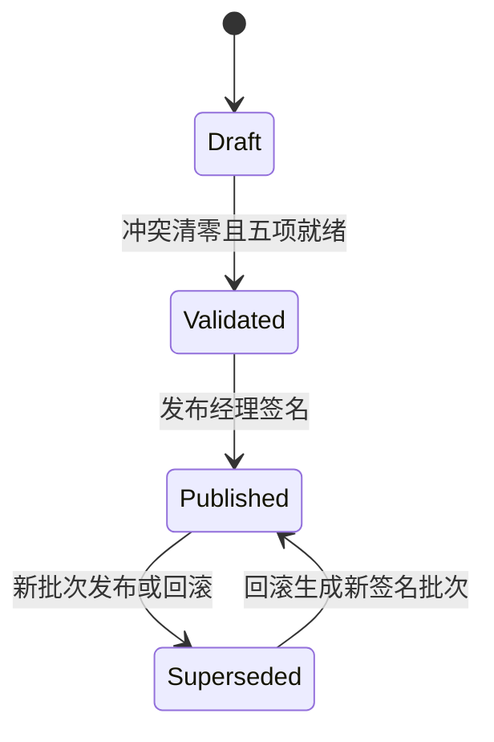

# XMP 园所教学调度与签名发布

状态：本地可运行协议。当前复用 FutureClass 的班级与排课模型作为设计底座，不向生产 ERP 写入数据。

## 为什么不是普通日历

园所排课的交付对象不是一个时间块，而是一堂满足全部运行条件的课。XMP 将课程版本、教师、空间、设备包和物料作为同一发布单元，任何一项不就绪都不能进入课堂。

## 调度门禁

- 三类资源冲突：教师、空间、设备包在重叠时间段不得重复占用。
- 五项课堂就绪：签名课程、教师、空间、设备包、物料全部满足。
- 代课与资源调整只能发生在草稿批次，并再次经过冲突验证。
- 验证与发布职责分离；发布生成不可覆盖的本地签名。
- 回滚不是覆盖历史，而是从历史批次生成一个新的签名发布批次。
- 重复命令使用幂等键拒绝二次执行，损坏快照不会进入运行状态。

## 与课程和课堂的连接

调度批次绑定课程工厂当前发布的签名版本。发布后，实时课堂读取当前签名教学计划，并显示班级、日期、时间、空间、课程版本与双重签名锁；正在运行的课堂不会被未发布草稿影响。

## 本地状态与事件

- 调度目录存储键：`xmp-teaching-schedule-v1`。
- 浏览器 `storage` 事件支持跨标签页同步。
- 调整、验证、发布和回滚写入 `scheduling` 事件域。
- 服务端事件迁移层只允许调度白名单事件；默认配置下仍为本地零外发。

## 自动化验收

- 8 条调度领域测试覆盖三类冲突、就绪门禁、课程绑定、职责分离、签名发布、安全代课、回滚、幂等与损坏快照。
- 浏览器流程覆盖冲突清零、物料确认、验证、发布，以及课堂读取签名计划。
- 调度测试纳入 XMP 的 33 条单元/状态机门禁和 17 条端到端回归。

## 生产化边界

当前 `LOCAL-SCHED-*` 只证明产品协议，不是生产密码学签名。试点前仍需接入真实教师身份与请假、空间容量、设备证书和在线状态、物料库存、ERP 事务写入、并发锁、正式签名密钥、通知送达、时区与校历，以及可审计的人工例外审批。
