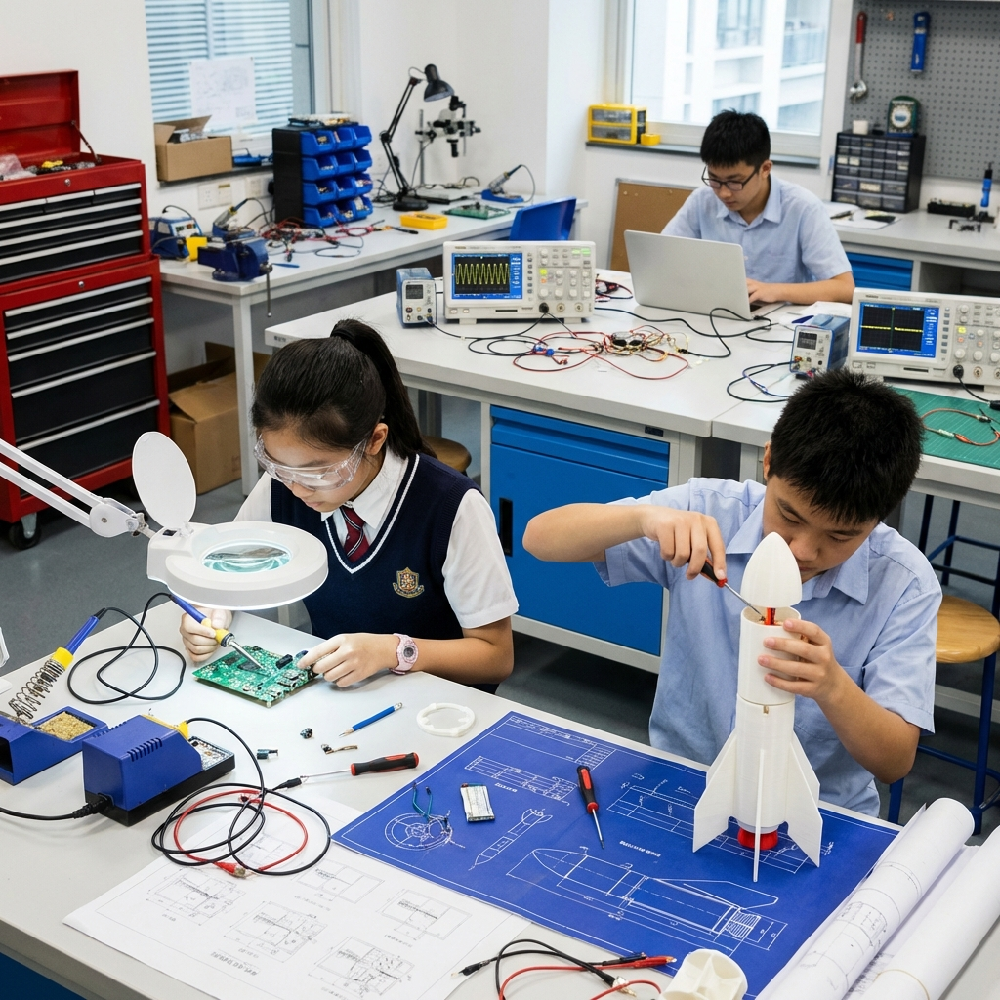
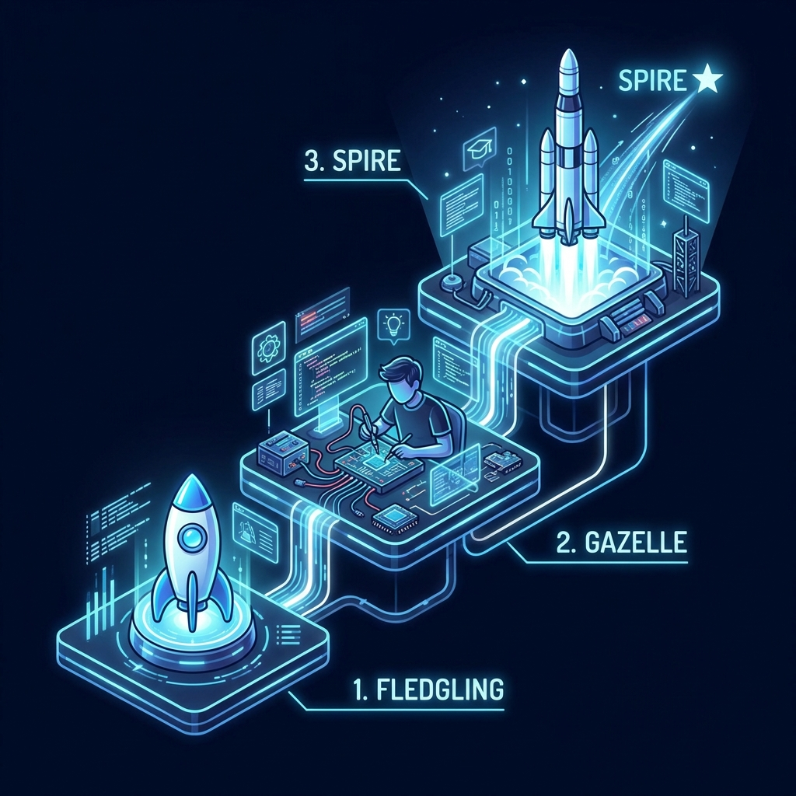

# 2025-2026年度成电创客瞪羚俱乐部
# 《探空火箭工程实践探究课程》

> **“所造之火，照亮星海”**
> 
> 你习惯了在纸面解题，却未曾亲手点燃过星海；
> 你习惯在试卷上解答理综大题，在标准答案中寻找逻辑；
> 但世界的复杂远不止纸面——
> 推力如何计算？信号怎样传输？算法能否让火箭更精准？

电子科大官方导师团，带你开启“大中贯通”的科研之旅。这不是一次简单的动手训练，这是一场面向未来的新工科创新人才跃迁。

---

## 第一部分：课程整体详细介绍

### 1.1 课程愿景：少年所望，皆可抵达

在标准答案的逻辑之外，真实世界是由推力、信号和算法构建的复杂系统。本课程不仅是动手能力的训练，更是面向未来新工科人才的第一次“跃迁”。

我们依托 **电子科技大学（UESTC）** 的顶尖学术资源，将大学实验室的“降维”设计与中学生的“升维”探究相结合，打造一个从“雏鹰”起步，最终触达“塔尖”的科创全栈培养体系。

未来，不是幻想，而是从一个电路开始搭建，从一段代码点亮智能，从一次点火直抵天际。

### 1.2 核心价值：以“成电力量”驱动工程实践

本课程深度融合了 **电子信息、航空航天、通信工程、机械结构、动力学原理与自动控制** 六大领域，具备以下硬核特征：

*   **专家导师领航**
    *   由电子科大教授、博士生导师作为学术导师顾问，亲临讲授火箭原理。
    *   由研究生、博士生团队担任项目导师。
    *   在电子科技大学校园、科技园区及相关科技企业内，完成从理论到实战的闭环。

*   **大中贯通理念**
    *   将成电新工科特色课程进行降维开发。
    *   中学生能早期接触 **Arduino MEGA2560 嵌入式开发**、**LoRa 无线空地通信** 及 **PCB 自主设计** 等大学核心专业知识。

*   **国家级场景体验**
    *   走进 **电子科技博物馆**，聆听电子工业的历史回响。
    *   探访 **国家重点实验室**（如太赫兹通信实验室），感知前沿脉搏。

### 1.3 “雏鹰—瞪羚—塔尖”：分层培养计划

我们构建了差异化的支持体系，确保每个阶段都有硬核产出。

| 阶段 | 对应人群 | 核心侧重 | 硬核产出 |
| :--- | :--- | :--- | :--- |
| **雏鹰阶段 (Fledgling)** | 面向初中阶段0课程基础学员 | **兴趣启蒙与物理直觉** | 高精度气压火箭 OpenRocket 仿真模型 |
| **瞪羚阶段 (Gazelle)** | 面向初中阶段有1-2年课程基础学员 | **硬核技能进阶** | 自主焊接的飞控 PCB 板 Python/C++ 驱动程序 |
| **塔尖阶段 (Spire)** | 面向初中高段及高中阶段学员 | **系统集成与科研初探** | 具备实时遥测功能的固体燃料探空火箭 学术报告或专利转化尝试 |

---

### 1.4 为什么选择这门课？

1.  **使用 3D 打印构建箭体**，体验材料力学的真实边界。
2.  **自主设计 PCB 与飞控代码**，赋予火箭“思考”的大脑。
3.  **实战发射与数据回归**，让你的科研报告具备真实的学术深度。

不积跬步，无以至千里。欢迎加入《探空火箭工程实践探究课程》，在这里，少年所望，皆可抵达！
