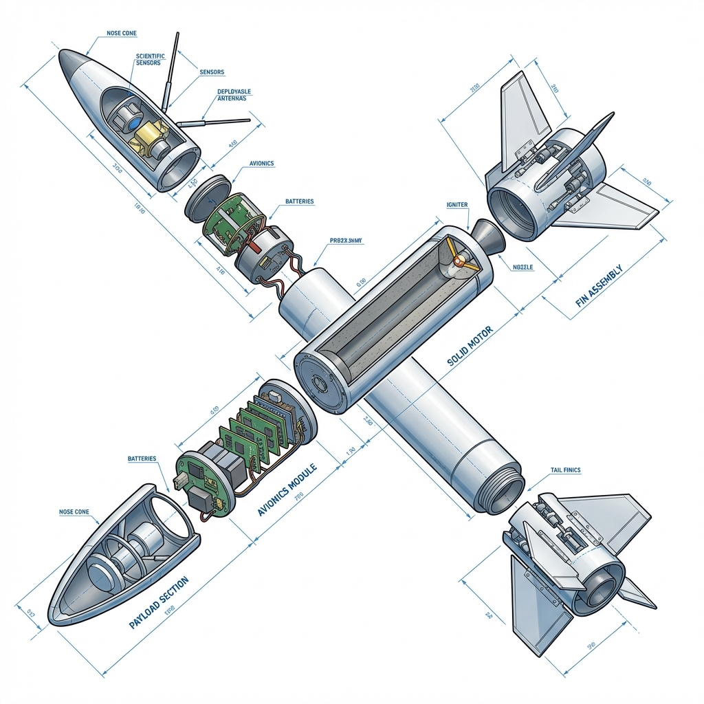

# 《探空火箭工程实践探究课程》
## 16次课程计划安排详细大纲（2025-2026春季学期）

本大纲基于学期教学周期，将探空火箭课程的实战精髓拆解为三个深度探究阶段，每周2课时（120分钟）。

---

### 第一阶段：原理溯源与数字化建模（第1-4次课）

> **阶段目标**：掌握火箭飞行的基本物理原理，熟练使用 OpenRocket 进行弹道仿真，输出具备理论支撑的火箭设计方案。

#### 第1课：项目开题与成电科创氛围感悟
*   **课程内容**：走进电子工业发展史，建立系统工程意识。学习火箭五大子系统：结构、动力、回收、控制、通信。
*   **核心任务**：建立工程笔记，签署“安全准则”。
*   **课程材料**：《工程与安全准则》、工程笔记本、探究性研究报告模板。

#### 第2课：空气动力学：揭开飞行的奥秘
*   **课程内容**：由航空专家讲解周围空间、空气动力学及火箭基本原理。分析重心（CG）与压心（CP）的动态平衡。
*   **公式引入**：根据牛顿第三定律探讨推力产生。
*   **课程材料**：火箭稳定性“Swing Test”实验套件。

#### 第3课：数字化双胞胎：OpenRocket 仿真模拟
*   **课程内容**：学习 OpenRocket 软件。输入 3D 打印材料（PETG/ASA）的物理参数，进行全弹道仿真。
*   **核心挑战**：预测火箭最大升限（Apogee）并调整尾翼形状以优化稳定性。
*   **课程材料**：.ork 格式的火箭数字模型文件。

#### 第4课：动力学深潜：固体燃料发动机原理
*   **课程内容**：分析固体发动机推力曲线。理解总冲与平均推力的概念。初探齐奥尔科夫斯基方程。
*   **数学应用**：计算不同质量比下的理论高度。
*   **课程材料**：基于不同质量比的模拟飞行报告。

---

### 第二阶段：电子信息实践与硬件研发（第5-10次课）

> **阶段目标**：完成飞控系统的硬件设计与嵌入式编程，实现传感器数据的采集、处理与存储。

#### 第5课：火箭的大脑：Arduino MEGA2560 嵌入式开发
*   **课程内容**：环境搭建与核心功能实现。学习控制系统的核心逻辑：传感器初始化与循环检测。
*   **硬核逻辑**：理解单片机处理 I/O 信号的实时性要求。
*   **课程材料**：飞控系统核心驱动代码原型。

#### 第6课：电路之魂：PCB 设计基础与 EDA 工具
*   **课程内容**：学习 PCB 制作与设计流程。了解原理图绘制与布局布线原则。
*   **实践环节**：在 EasyEDA 中完成一个简易航电背板的布线设计。
*   **课程材料**：个人设计的飞控 PCB 样稿。

#### 第7课：空间感知：IMU 惯导模块数据融合
*   **课程内容**：集成 MPU6050 传感器，学习加速度与角速度的数据读取。理解 I2C 通信协议。
*   **即时反馈**：通过 Processing 软件实时展示 3D 姿态模型。
*   **课程材料**：姿态传感器校准曲线图。

#### 第8课：高度解算：高精度气压计应用
*   **课程内容**：学习 BMP180/280 气压计原理。通过气压变化实时计算海拔高度，加入滤波算法减少噪声。
*   **课程材料**：海拔解算精度分析报告。

#### 第9课：黑匣子系统：SD 卡存储与日志记录
*   **课程内容**：学习 SPI 协议。实现多路传感器数据同步存入 SD 卡。理解断电保护逻辑。
*   **课程材料**：可读取的飞行模拟数据包（CSV格式）。

#### 第10课：航电总装：飞控系统焊接与调试
*   **课程内容**：进行飞控系统的焊接与组装实操。掌握精密焊接技术与元器件布局优化。
*   **核心任务**：整机通电测试，确保传感器通信率 100%。
*   **课程材料**：完成焊接的实物飞控母板。

---

### 第三阶段：系统集成与外场发射演练（第11-16次课）

> **阶段目标**：完成整箭装配，实现无线遥测与回收控制，进行实地发射并完成科研报告。

#### 第11课：3D 成型：火箭本体结构构建
*   **课程内容**：使用轻质高强度 3D 打印材料（PETG/ASA）构建火箭本体结构。设计载荷舱（Payload Bay）与蛋舱保护结构。
*   **课程材料**：3D 打印完成的火箭关键构件。

#### 第12课：安全降落：开伞控制与回收算法
*   **课程内容**：火箭控制系统课程（开伞控制）。编写基于高度差或加速度突变的智能抛伞算法。
*   **实操环节**：伞降系统安装与地面弹出测试。
*   **课程材料**：连续 3 次弹出成功的回收系统。

#### 第13课：无线空地链路：LoRa 遥测通信
*   **课程内容**：学习无线空地通信模块。实现飞行参数远程回传至地面站接收装置。
*   **核心挑战**：设计稳定可靠的空地通讯协议。
*   **课程材料**：稳定的无线遥测通信链路。

#### 第14课：整箭装配与综合调试
*   **课程内容**：探空火箭全系统装配。进行系统联调、姿态解算测试与地面拉力实验。
*   **管理意识**：签署 Pre-flight Checklist（飞行前检查单）。
*   **课程材料**：具备发射条件的整箭。

#### 第15课：发射日：实地发射与数据采集
*   **课程内容**：在专业实践基地进行综合调试与发射试验。采集仿真数据、姿态数据并实时回传。
*   **核心目标**：实现火箭从点火、升空、抛伞到平稳回收的完整闭环。
*   **课程材料**：实地发射成功的飞行记录与遥测视频。

#### 第16课：科研初探：数据回归与展演汇报
*   **课程内容**：对仿真数据与实测数据进行对比分析。撰写汇报展演 PPT，总结项目得失。
*   **收官环节**：举行小组汇报展演，颁发电子科大官方证书。
*   **课程材料**：最终版《探空火箭工程研学报告》与结营作品展示。
