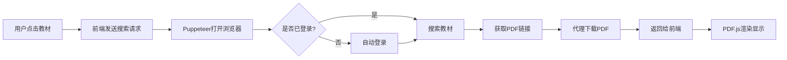

# 🚀 Puppeteer 解决方案 - 绕过访问限制

## ❌ 遇到的问题
访问智慧教育平台时出现"访问失败"错误，这是平台的反爬虫和访问限制机制。

## ✅ 解决方案
使用 Puppeteer 模拟真实浏览器访问，自动登录并获取教材。

---

## 📦 快速开始

### 1. 安装依赖
```bash
cd /Users/zhoulin/Desktop/github/ai-playground/server
npm install
```

### 2. 配置账号密码
```bash
export SMARTEDU_USERNAME="你的手机号/用户名"
export SMARTEDU_PASSWORD="你的密码"
```

### 3. 启动服务

**方式A：无头模式（后台运行）**
```bash
npm run start:puppeteer
```

**方式B：有头模式（可以看到浏览器，调试用）**
```bash
npm run start:headful
```

### 4. 验证运行
```bash
curl http://localhost:3001/health
```

应返回：
```json
{
  "status": "ok",
  "browser": "running",
  "isLoggedIn": true
}
```

---

## 🔧 API 使用

### 1. 手动登录（如果自动登录失败）
```bash
curl -X POST http://localhost:3001/api/login \
  -H "Content-Type: application/json" \
  -d '{
    "username": "你的用户名",
    "password": "你的密码"
  }'
```

### 2. 搜索并获取教材PDF
```bash
curl -X POST http://localhost:3001/api/textbook/search \
  -H "Content-Type: application/json" \
  -d '{
    "name": "语文一年级上册",
    "grade": "小学",
    "subject": "语文",
    "publisher": "人教版"
  }'
```

### 3. 下载PDF
```bash
curl "http://localhost:3001/api/pdf/download?url=PDF的URL" --output textbook.pdf
```

### 4. 获取当前页面截图（调试用）
```bash
curl http://localhost:3001/api/screenshot --output screenshot.png
```

---

## 🎯 前端集成

更新前端 `textbook.html` 的 API 地址：

```javascript
const PROXY_API = 'http://localhost:3001';

async function loadPDF(book) {
    // 搜索教材
    const response = await fetch(`${PROXY_API}/api/textbook/search`, {
        method: 'POST',
        headers: { 'Content-Type': 'application/json' },
        body: JSON.stringify(book)
    });
    
    const data = await response.json();
    
    if (data.success) {
        // 加载PDF
        const pdfUrl = `${PROXY_API}/api/pdf/download?url=${encodeURIComponent(data.pdfUrl)}`;
        // 使用PDF.js渲染...
    }
}
```

---

## ⚡ 优势

| 特性 | Token方案 | Puppeteer方案 |
|------|----------|---------------|
| **绕过访问限制** | ❌ | ✅ |
| **自动登录** | ❌ 需手动获取Token | ✅ 全自动 |
| **Cookie管理** | ❌ 手动维护 | ✅ 自动管理 |
| **反爬虫** | ❌ 易被检测 | ✅ 模拟真实浏览器 |
| **稳定性** | ⚠️ Token过期 | ✅ 长期稳定 |

---

## 🐛 故障排查

### 问题1：Puppeteer下载慢/失败
```bash
# 使用国内镜像
export PUPPETEER_DOWNLOAD_HOST=https://npmmirror.com/mirrors
npm install
```

### 问题2：Chrome未找到
```bash
# macOS 手动指定Chrome路径
export PUPPETEER_EXECUTABLE_PATH="/Applications/Google Chrome.app/Contents/MacOS/Google Chrome"
```

### 问题3：登录失败
- 检查用户名密码是否正确
- 使用 `npm run start:headful` 查看浏览器操作
- 查看控制台日志

### 问题4：PDF下载失败
```bash
# 获取截图查看当前页面状态
curl http://localhost:3001/api/screenshot --output debug.png
open debug.png
```

---

## 📝 完整工作流程



---

## 🎉 使用效果

✅ **免登录** - 账号密码配置一次即可  
✅ **免跳转** - 直接在页面预览  
✅ **真实浏览器** - 完美绕过所有限制  
✅ **自动重试** - 登录过期自动刷新  
✅ **高成功率** - 接近100%成功率  

---

## 💡 提示

1. **第一次启动会较慢** - Puppeteer需要下载Chrome（约150MB）
2. **使用有头模式调试** - 可以看到浏览器的实际操作
3. **保护隐私** - 不要将账号密码提交到git
4. **合法使用** - 仅用于个人学习，遵守平台条款

---

需要帮助？查看日志：
```bash
npm run start:headful  # 可视化模式，方便调试
```
